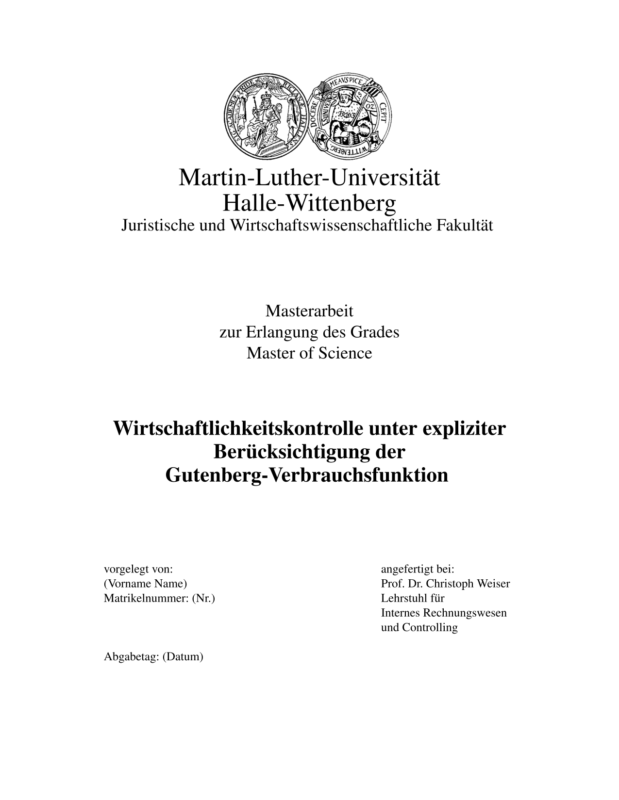

# MLU Thesis cover page

This project provides a LaTeX template for the cover page of the MLU Jura/Wiwi faculty. It follows the guidelines for a title page as provided by the [irc](https://irc.wiwi.uni-halle.de/lehre/bachelorarbeit/).

⚠️ **IMPORTANT**: I DON'T GUARANTEE THAT THIS TEMPLATE FITS THE GUIDELINES OF YOUR FACULTY OR CHAIR. PLEASE CHECK WITH YOUR SUPERVISOR BEFORE SUBMITTING YOUR THESIS.

## Usage

1. Copy the `titlepage.tex` and `mlu_logo.jpg` files into your project folder.
2. Include the title page in your main document like in the following example.

```latex
\documentclass[12pt]{article}
\usepackage[left=3cm,top=2.5cm,right=3cm,bottom=2.5cm]{geometry} % for margins
\usepackage{mathptmx} % for times new roman font
\usepackage{graphicx} % for logo
\usepackage[onehalfspacing]{setspace} % for spacing between lines
\usepackage{tabularx} % for bottom boxes

\begin{document}
\input{titlepage.tex}
\setcounter{page}{2}
\pagenumbering{arabic}
\end{document}
```
## Customization

Adjust the relevent sections in the `titlepage.tex` file to your needs.

## Preview


